```mermaid
graph TD
    %% 数据源阶段
    subgraph "📁 HowToCook 数据源"
        A1["`HowToCook/dishes/
        ├── meat_dish/
        │   ├── 糖醋排骨.md
        │   └── 红烧肉/红烧肉.md
        ├── vegetable_dish/
        ├── soup/
        └── ... (11个分类)`"]
    end

    %% 第一阶段：原生解析
    subgraph "🔧 阶段1: 原生JSON生成 (RecipeParser)"
        B1[遍历所有分类目录]
        B2[读取 .md 文件内容]
        B3["`正则表达式提取章节:
        • ## 必备原料和工具
        • ## 计算  
        • ## 操作
        • ## 附加内容`"]
        B4[提取菜品名称和分类]
        B5[生成内容SHA256哈希]
        B6["`生成 RawRecipe 对象
        {
          dishName: '糖醋排骨',
          category: 'meat_dish',  
          contentHash: 'sha256...',
          rawContent: {
            ingredientsAndTools: '原文本',
            calculation: '原文本',
            steps: '原文本'
          }
        }`"]
    end

    %% 第二阶段：AI处理
    subgraph "🤖 阶段2: AI智能打标 (LLMBasedTagger)"
        C1[加载现有数据库]
        C2["`增量检测:
        对比contentHash
        只处理新增/变更菜谱`"]
        C3["`LLM调用 (generateObject + Zod):
        System: 你是美食数据分析师
        Input: 菜名 + rawContent
        Output: 结构化标签`"]
        C4["`提取四维标签:
        • taste: [酸, 甜]
        • cookingStyle: [炸, 烧]  
        • season: [春,夏,秋,冬]
        • suitability: [kid_friendly]`"]
        C5["`算法计算难度(1-5星):
        • 步骤数量权重
        • 烹饪方法复杂度
        • 食材数量`"]
        C6["`批处理控制:
        • 每批10个菜谱
        • API调用间隔
        • 失败重试机制`"]
        C7["`生成 ProcessedRecipe
        = RawRecipe + tags + difficulty`"]
    end

    %% 第三阶段：数据库构建
    subgraph "💾 阶段3: 数据库构建 (DatabaseBuilder)"
        D1["`构建轻量级索引
        recipes_index.json
        [只含: dishName, category, 
         difficulty, tags]`"]
        D2["`构建完整数据库
        recipes_data.json  
        {dishName: ProcessedRecipe}`"]
        D3["`生成统计信息
        statistics.json
        分类/难度/标签分布`"]
    end

    %% 第四阶段：运行时调用
    subgraph "🚀 阶段4: 运行时数据访问 (KnowledgeBase)"
        E1["`初始化加载:
        完整加载两个JSON到内存
        recipesIndex[] + recipesData{}`"]
        E2["`快速筛选 (基于索引):
        • 按分类过滤  
        • 按标签匹配
        • 按难度筛选`"]
        E3["`详细查询 (基于数据):
        • O(1) 按菜名获取完整信息
        • 获取 rawContent 原始文本`"]
    end

    %% Agent调用层
    subgraph "🎯 Agent 数据调用模式"
        F1["`IntentExtractor:
        不直接查询数据库
        只处理用户输入`"]
        F2["`MenuRecommender:
        1. getRecommendedCandidates()
        2. 筛选候选菜品  
        3. LLM从候选中推荐`"]
        F3["`WorkflowPlanner:
        获取确认菜品的
        完整rawContent用于规划`"]
    end

    %% 连接关系
    A1 --> B1
    B1 --> B2 --> B3 --> B4 --> B5 --> B6
    
    B6 --> C1
    C1 --> C2 --> C3 --> C4 --> C5 --> C6 --> C7
    
    C7 --> D1
    C7 --> D2  
    C7 --> D3
    
    D1 --> E1
    D2 --> E1
    E1 --> E2 --> E3
    
    E2 --> F2
    E3 --> F2
    E3 --> F3

    %% 样式定义
    classDef sourceStyle fill:#e1f5fe,stroke:#01579b,stroke-width:2px
    classDef processStyle fill:#f3e5f5,stroke:#4a148c,stroke-width:2px  
    classDef aiStyle fill:#fff3e0,stroke:#e65100,stroke-width:2px
    classDef dbStyle fill:#e8f5e8,stroke:#1b5e20,stroke-width:2px
    classDef runtimeStyle fill:#fff8e1,stroke:#f57f17,stroke-width:2px
    classDef agentStyle fill:#fce4ec,stroke:#880e4f,stroke-width:2px

    class A1 sourceStyle
    class B1,B2,B3,B4,B5,B6 processStyle
    class C1,C2,C3,C4,C5,C6,C7 aiStyle
    class D1,D2,D3 dbStyle
    class E1,E2,E3 runtimeStyle
    class F1,F2,F3 agentStyle
```

## 关键数据流特点总结

### 🎯 **设计优势**
1. **增量处理**: 通过SHA256哈希避免重复LLM调用，大幅降低成本
2. **两阶段分离**: 确定性解析与AI处理分离，易于调试和维护  
3. **查询优化**: 双文件结构(索引+数据)，平衡存储和查询性能
4. **容错健壮**: 各阶段独立，单点失败不影响整体流程

### ⚡ **性能特性**
- **解析阶段**: O(n) 遍历所有MD文件，纯文本处理速度快
- **AI阶段**: 增量处理，只对变更内容调用LLM，支持批处理控制
- **存储阶段**: 一次性生成，针对查询模式优化的存储结构
- **查询阶段**: 内存加载，索引筛选O(n)，详细查询O(1)

### 🔄 **数据一致性**
- 内容哈希确保数据变更追踪
- 原始文本完整保留，支持重新处理
- 结构化标签与原始内容分离存储
- 统计信息实时计算生成