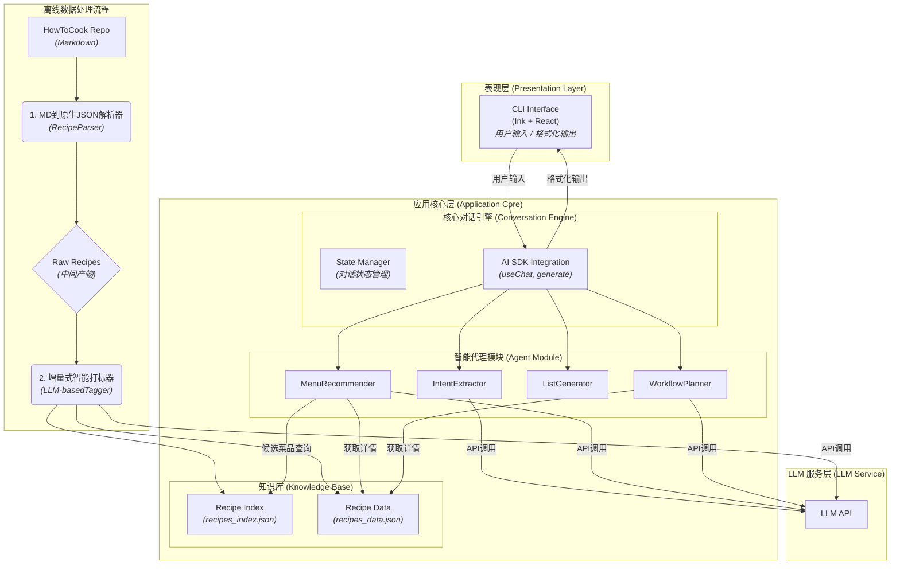

### **CookingAgent 架构设计文档**

**版本: 1.3**
**日期: 2025年7月8日**

#### 1\. 概述

本系统是一个基于大型语言模型（LLM）的命令行聊天机器人（ChatBot），旨在为用户提供智能化的菜谱推荐和烹饪流程规划。整体架构采用分层设计，分为**数据层**、**应用核心层**和**表现层**，确保系统的高内聚、低耦合和可扩展性。

-----

#### 2\. 架构图



-----

#### 3\. 模块设计

##### 3.1 数据预处理模块 (离线)

此模块作为独立脚本运行，采用**两阶段、增量式**的处理流程。

  * **阶段一：原生JSON生成**

      * **`RecipeParser`**:
          * **职责**: 遍历所有 `.md` 菜谱文件，使用确定性逻辑（如正则表达式）将其解析为“原生”的结构化JSON对象。此阶段**不调用LLM**。
          * **核心产出**: 为每个菜谱生成一个包含原始文本块的JSON对象，并计算其内容的哈希值。
          * **原生JSON Schema (示例)**:
            ```json
            {
              "dishName": "糖醋排骨",
              "sourceFile": "dishes/meat_dish/糖醋排骨.md",
              "contentHash": "sha256_hash_string",
              "rawContent": {
                "description": "...",
                "ingredientsAndTools": "...",
                "calculation": "...",
                "steps": "- 排骨与姜片放入冷水中..."
              }
            }
            ```

  * **阶段二：增量式智能打标**

      * **`LLM-basedTagger`**:
          * **职责**: 读取原生JSON数据，并与已有的最终菜谱数据库进行比对。
          * **增量逻辑**: 仅对**新出现**的或`contentHash`**已改变**的菜谱调用LLM API，进行智能标签和元数据生成。
          * **实现**: 调用LLM，传入原生JSON中的`dishName`和`rawContent`，生成`tags`等增强数据。**增加Zod Schema验证**，确保LLM输出的健壮性；若验证失败，则标记该菜谱待审核。

  * **`DatabaseBuilder`**:

      * **职责**: 整合阶段二的输出，生成最终供应用使用的两个文件。
      * **`recipes_index.json`**: 一个轻量级索引文件，包含所有菜品的`dishName`、`category`、`difficulty`和`tags`，用于快速筛选。
      * **`recipes_data.json`**: 一个包含所有菜品完整信息的重量级数据文件，按`dishName`作为键进行索引，方便按需查询。
      * **最终数据 Schema (在 `recipes_data.json` 中)**:
        ```json
        {
          "糖醋排骨": {
            "category": "meat_dish",
            "difficulty": 4,
            "contentHash": "sha256_hash_string",
            "tags": {
              "taste": ["酸", "甜"],
              "cookingStyle": ["烧", "炸"],
              ...
            },
            "rawIngredientsText": "...",
            "rawCalculationText": "...",
            "rawStepsText": "- 排骨与姜片放入冷水中..."
          },
          ...
        }
        ```

##### 3.2 应用核心层 (在线)

  * **智能代理模块 (Agent Module) - 核心变更**:
      * **`MenuRecommender`**: 推荐逻辑现在基于 `recipes_index.json` 进行快速筛选。
      * **`ListGenerator`**:
          * **职责变更**: 不再进行原料解析。接收用户确认的菜单后，直接从 `recipes_data.json` 中提取并呈现 `rawIngredientsText` 和 `rawCalculationText` 的原始文本。
      * **`WorkflowPlanner`**:
          * **职责变更**: 接收到确认菜单后，从 `recipes_data.json` 中获取每道菜的 `rawStepsText`。
          * **LLM交互**: 将原始的、未经处理的Markdown步骤文本直接传递给LLM，让其在**运行时**进行解析、规划和编排。

-----

#### 4\. LLM Prompt 与交互策略

本章节定义了**智能代理模块 (Agent Module)** 中各个函数与 LLM 服务层交互的具体实现方式。

##### 4.1 通用原则

  * **角色扮演 (Persona)**: 每个与 LLM 的交互都应始于一个明确的系统提示（System Prompt），为其设定一个专家角色，如“美食分析师”、“高级营养师”等，以引导其生成更专业、更符合期望的输出。
  * **结构化输入输出**: 尽可能使用 JSON 格式与 LLM 进行数据交换，以保证数据的一致性和程序的可解析性。Vercel AI SDK 的 `generate` 配合 Zod 等 schema 验证库是实现此目标的理想选择。

##### 4.2 模块实现细则

###### 4.2.1 `LLM-basedTagger` (离线数据增强)

  * **目的**: 从菜谱文本中提取结构化标签。
  * **输入**: `(dishName: string, rawContent: object)`
  * **System Prompt**:
    ```
    你是一个精通中餐的美食数据分析师。你的任务是根据提供的菜谱信息，提取关键特征，并以严格的JSON格式输出。
    ```
  * **User Prompt (传递给 `generate` API)**:
    ```json
    {
      "task": "Extract recipe tags",
      "dishName": "{dishName}",
      "rawContent": "{rawContent}",
      "output_schema": {
        "taste": "string[] // 从 [酸, 甜, 苦, 辣, 咸, 鲜, 麻, 香] 中选择",
        "cookingStyle": "string[] // 从 [炒, 蒸, 炖, 炸, 凉拌, 烤, 烧, 焖] 中选择",
        "season": "string[] // 从 [春, 夏, 秋, 冬] 中选择",
        "suitability": "string[] // 从 [kid_friendly, pregnancy_safe] 中选择，如果没有则为空数组"
      }
    }
    ```
  * **预期输出**: 一个符合 `output_schema` 的 JSON 对象。

###### 4.2.2 `extractIntent(userInput)` (在线意图提取)

  * **目的**: 从用户的自然语言对话中解析出结构化的用餐偏好。
  * **输入**: `(userInput: string, conversationHistory: Message[])`
  * **System Prompt**:
    ```
    你是一个善于沟通、经验丰富的智能点餐员。你的任务是准确理解顾客的需求，并将其转化为结构化的数据。
    ```
  * **User Prompt (传递给 `generate` API)**:
    ```json
    {
      "task": "Extract user preferences from conversation",
      "conversation": "{conversationHistory}",
      "latest_user_message": "{userInput}",
      "output_schema": {
        "peopleCount": "number | null",
        "tastePreferences": "string[] | null",
        "ingredientExclusions": "string[] | null",
        "specialGroup": "string[] | null // 例如: ['kid', 'pregnant']",
        "maxCookingTimeMinutes": "number | null"
      }
    }
    ```
  * **预期输出**: 一个符合 `output_schema` 的 JSON 对象，其中未提及的字段为 `null`。

###### 4.2.3 `recommendMenu(preferences, candidateDishes)` (在线菜单推荐)

  * **目的**: 基于用户偏好和候选菜品，生成一份科学、人性化的菜单。
  * **输入**: `(preferences: object, candidateDishes: Dish[])`
  * **System Prompt**:
    ```
    你是一位高级营养师和米其林餐厅的行政总厨。你的任务是根据顾客的偏好和今天的可选菜品，设计一份营养均衡、风味协调的完美晚餐菜单。你需要为你的选择给出令人信服的理由。
    ```
  * **User Prompt (传递给 `generate` API)**:
    ```json
    {
      "task": "Create a dinner menu",
      "userPreferences": "{preferences}",
      "availableDishes": "{candidateDishes}",
      "menuComposition": {
          "mainDishes": 2, // 根据人数动态计算
          "vegetableDishes": 1,
          "soup": 1
      },
      "output_schema": {
        "menu": [
          {
            "dishName": "string",
            "recommendationReason": "string"
          }
        ]
      }
    }
    ```
  * **预期输出**: 一个包含 `menu` 数组的 JSON 对象。

###### 4.2.4 `planWorkflow(confirmedMenu)` (在线流程规划)

  * **目的**: 为多道菜的烹饪过程制定一个高效、并行的执行计划。
  * **输入**: `(confirmedMenu: {dishName: string, rawStepsText: string}[])`
  * **System Prompt**:
    ```
    你是一位效率大师和厨房总指挥。你的任务是将一份菜单的多个烹饪流程（以原始Markdown格式提供），整合成一个清晰、高效、可执行的作战计划，特别要考虑到厨房新手可能会手忙脚乱。请明确指出可以并行操作的步骤。
    ```
  * **User Prompt (传递给 `useChat` API)**:
    ```
    这是今晚的菜单和每道菜的原始烹饪步骤，请帮我制定一个最优的烹饪流程。
    菜单详情: 
    {JSON.stringify(confirmedMenu)}

    请直接以自然语言输出步骤列表，用 🕒 符号标注预估时间，用 ✨ 符号高亮并行操作提示。
    ```
  * **预期输出**: 一段流式的、格式化的 Markdown 文本，供 `Ink` 直接渲染。

-----

#### 5\. 技术选型理由

  * **TypeScript**: 为复杂的业务逻辑提供类型安全，减少运行时错误，提高代码可维护性。
  * **Vercel AI SDK**: 极大地简化了与多种 LLM 后端交互的复杂性，内置了对流式响应、工具调用（未来可能用到）和结构化输出（如使用 Zod）的良好支持。
  * **Ink**: 允许我们使用声明式的 React 范式来构建丰富的、动态的命令行界面，体验远超传统的 `console.log`。
  * **离线数据处理**: 将菜谱解析和标签化作为离线步骤，保证了 Agent 在线服务时的高性能查询，避免了每次对话都去实时解析大量文件。